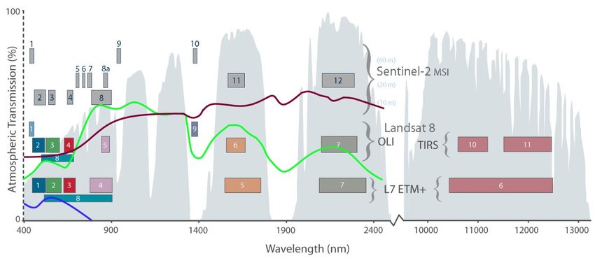

# False color composite

In the previous step, we used the `ol/source/GeoTIFF` source to render a true color image from a single, multi-band source (with red, green, blue, and alpha bands).  In this example, we'll pull in data from outside the visible spectrum and use it to render a false color composite.

We want to render a false color composite that highlights vegetation over bare soil areas.  Chlorophyll-rich vegetation is bright in the near-infrared (Sentinel-2 B08) portion of the spectrum compared with its reflectance in visible wavelengths.  By contrast, bare soil is not as bright in near-infrared compared with its reflectance in visible wavelengths.  See the plot below for the reflectance spectra of green vegetation and bare soil shown with the Sentinel-2 bands.

To highlight vegetation in multi-spectral imagery, it is common to show the near-infrared (B08) reflectance in the red channel, red reflectance (B04) in the green channel, and green reflectance (B03) in the blue channel.  We can use the `ol/source/GeoTIFF` source to do this by loading three separate single-band GeoTIFF images in RGB order.

Update your `main.js` so the source looks like the following:

[import:'source'](../../../src/en/examples/cog/false-color.js)
