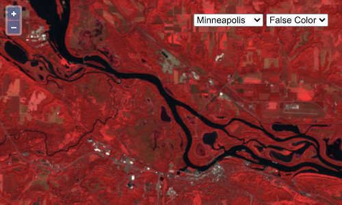

# Visualization chooser (continued)

The final missing piece of our COG explorer is to make it so the user can choose the imagery source.  While this section is already getting quite long, you may be able to tell that there is not that much more work involved in adding an image chooser.  Let's do it!

The first thing we need to do is come up with a list of images that should be displayed.  For each image, we want to display a `name` to show the user in a `<select>` element, and we need to have a `base` for the GeoTIFF URL.  So we'll want to add something like this to your `main.js`:

[import:'images'](../../../src/en/examples/cog/viz-plus.js)

Next, we'll add another `<select>` element to let the user choose the image.  In your `index.html`, adjust the controls to look like this:

[import:'markup'](../../../src/en/examples/cog/viz-plus.html)

Back to the JavaScript, we need to populate that `<select>` element with one `<option>` for each imagery source.  In your `main.js` add the following:

[import:'image-selector'](../../../src/en/examples/cog/viz-plus.js)

Now we just need to make a minor adjustment to the function that updates our visualization so it grabs the `base` URL from the selected imagery source.  In `main.js` edit the `updateVisualization` function and surrounding lines so it looks something like this:

[import:'update'](../../../src/en/examples/cog/viz-plus.js)

Note that we also only now update the view if the user has selected a new imagery source.  This is nicer than zooming out to the full extent whenever a new visualization type is selected.

Reload {{book.workshopUrl}}/. Boom!

