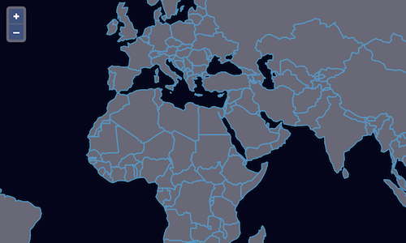

# Rendering GeoJSON

Before getting into editing, we'll take a look at basic feature rendering with a vector source and layer.  The workshop includes a `countries.json` GeoJSON file in the `data` directory.  We'll start by just loading that data up and rendering it on a map.

First, edit your `index.html` in order to add a dark background to the map:

[import](../../../src/en/examples/vector/geojson.html)

Now we'll import the three important ingredients for working with vector data:

 * a format for reading and writing serialized data (GeoJSON in this case)
 * a vector source for fetching the data and managing a spatial index of features
 * a vector layer for rendering the features on the map

Update your `main.js` to load and render a local file containing GeoJSON features:

[import](../../../src/en/examples/vector/geojson.js)

You should now be able to see a map with country borders at {{book.workshopUrl}}/.

Since we'll be reloading the page a lot, it would be nice if the map stayed where we left it in a reload.  We can bring in the `Link` interaction to make this work.

In our `main.js` we'll import the new interaction:

[import:'import'](../../../src/en/examples/vector/sync.js)

We next need to assign our map to a variable (named `map`) so we can add the interaction to it:

[import:'map-const'](../../../src/en/examples/vector/drag-n-drop.js)

And now we can add a new link interaction to our map:

[import:'sync'](../../../src/en/examples/vector/sync.js)

Now you should see that page reloads keep the map view stable.  And the back button works as you might expect.
