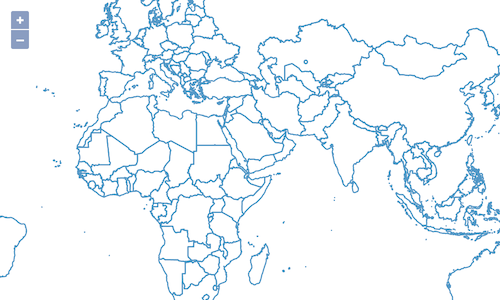

# The VectorTile layer

We now know how to load tiled images, and we have seen different ways to load and render vector data. But what if we could have tiles that are fast to transfer to the browser, and can be styled on the fly? Well, this is what vector tiles were made for. OpenLayers supports vector tiles through the `VectorTile` layer.

## A world map rendered from vector data

We'll start with the same markup in `index.html` as in the [Basics](../basics/) exercise.

[import](../../../src/en/examples/vectortile/map.html)

As usual, we save `index.html` in the root of our workshop folder.

For the application, we'll start with a fresh `main.js` in the root of the workshop folder, and add the required imports:

[import:'imports'](../../../src/en/examples/vectortile/map.js)

The data source we are going to use is a simple map of the countries of the world from Natural Earth data, served as vector tiles by GeoServer.

The map setup we're going to create here is the same that we have used in previous exercises:

[import:'map'](../../../src/en/examples/vectortile/map.js)

The layer type we are going to use this time is a `VectorTileLayer`, with a `VectorTileSource`:

[import:'layer'](../../../src/en/examples/vectortile/map.js)

Our data source provides only zoom levels `0` to `14`, so we need to pass this information to the source. Vector tile layers are usually optimized for a tile size of 512 pixels, which is also the default for the VectorTile source's tile grid. The data provider requires us to display some `attributions`, which we are adding to the source configuration as well.

As you can see, a `VectorTileSource` is configured with a `format` and a `url`, just like a `VectorSource`. The `MVT` format parses Mapbox Vector Tiles. Like with raster tiles, the tile data is accessed by zoom level and x and y coordinates of the tile. Therefore, the URL includes a `{z}` placeholder for the zoom level, and `{x}` and `{y}` placeholders for the tile coordinates.

The working example at {{book.workshopUrl}}/ shows an unstyled vector tile map like this:

