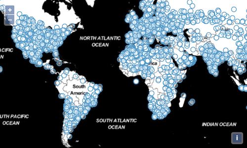

# Rendering meteorites with Canvas 2D

In OpenLayers 6, each layer in a map has an independent renderer.  Previously, all layer rendering was managed by a single map renderer and depended on a single rendering strategy.  So prior to OpenLayers 6, you needed to choose between Canvas 2D or WebGL rendering for all layers.  In OpenLayers 6, you can have a map composed of layers with different rendering strategies.  For example, you can render some layers with a Canvas 2D renderer and others with a WebGL renderer.

The `ol/layer/Vector` class uses Canvas 2D to render points, lines, or polygons.  This layer has a full featured renderer with a ton of flexibility in feature styling.  For very large numbers of features, WebGL is a more appropriate technology.  In this module, we'll start by using Canvas 2D to render 45,000 meteorite locations and then migrate the example to WebGL.

First, edit your `index.html` so we're ready to render a full page map:

[import](../../../src/en/examples/webgl/meteorites.html)

Next we'll fetch and parse data from a local CSV file, add the resulting features to a vector source, and render it on the map with a vector layer.

The `meteorites.csv` file has data in it that looks like this:
```
name,mass,year,reclat,reclong
Aachen,21,1880,50.775000,6.083330
...
```

The first line of the file is a header line that we'll skip over when parsing.  Subsequent lines have the name of the site, the mass of the meteorite, the year of impact, the latitude, and the longitude separated by commas.  We'll use an `XMLHttpRequest` client to fetch the data and write a short function to parse lines in the file as features with point geometries.

Update your `main.js` to load and render a local CSV file with data representing meteorite impacts:

[import](../../../src/en/examples/webgl/meteorites.js)

After fetching and parsing the data, features are added to a vector source.  This source is rendered in a vector layer over a tile layer.  We aren't doing any custom styling of the features here, the point is just to see how it feels to use the map with 45,000 features rendered with Canvas 2D.


